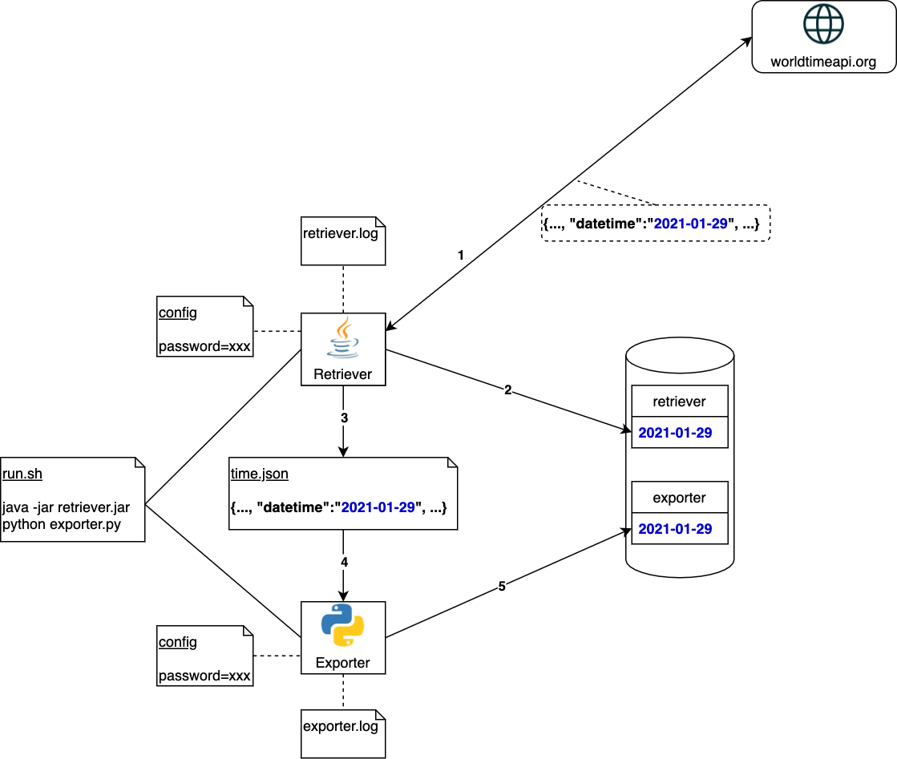
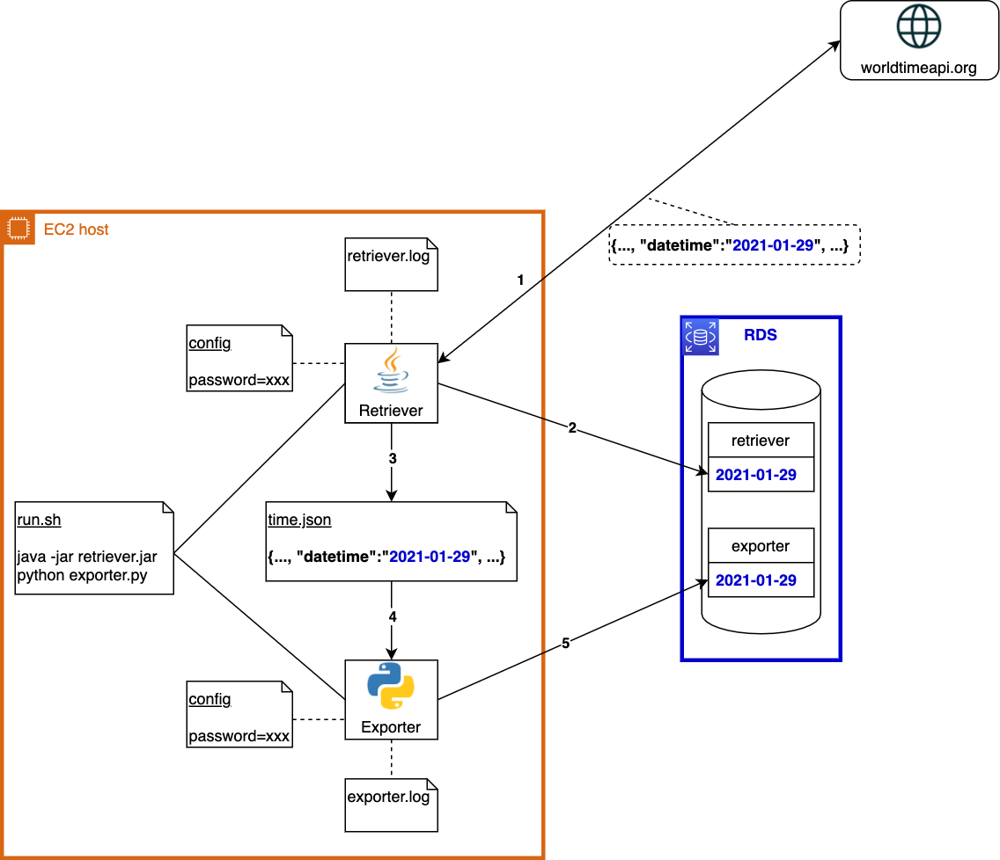
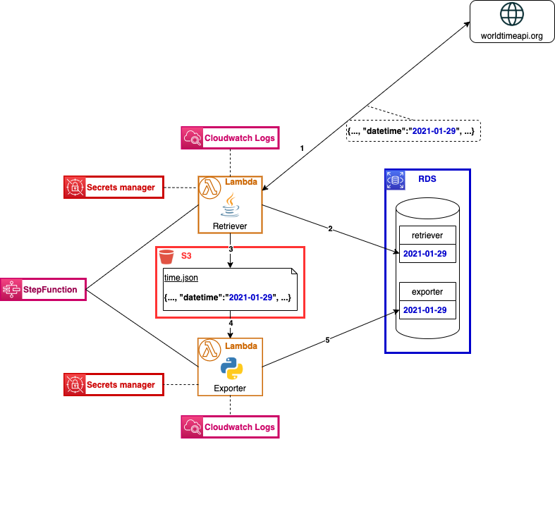

## Intro

This repo contains two different AWS setups for an application that has two components: a Java component, and a Python component.
1. The first setup is a more "classic" approach, where the entire application is deployed on an EC2 instance.
2. The second setup is the same application in a Serverless architecture.

## The Application

The following diagram shows the application components:

Some details:
* The application is composed of two components:
  * Retriever: gets the current time from `worldtimeapi.org`, updates the `retriever` table, and exports the json response to a text file.
  * Exporter: reads the json file created by the Retriever and updates the `exporter` table.
* Since there is a dependency between these two components (the json file) there is a `run.sh` script that properly orchestrates the invocations.
* Both components output the application logs to their respective log files.
* Both components store DB credentials in config files. (**NOT GOOD!**)
  

