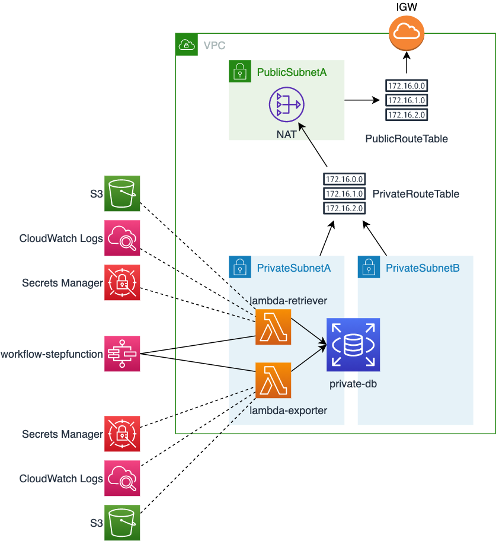

## Retriever

In order to migrate the Retriever application to a Serverless architecture, the following changes will be done:
* In order to run in Lambda, we must add soem new dependencies, and the `main()` method must be replaced with a `handle()` method:
  * In `pom.xml`
  ```xml
    <dependency>
      <groupId>com.amazonaws</groupId>
      <artifactId>aws-lambda-java-core</artifactId>
    </dependency>
    <dependency>
      <groupId>com.amazonaws</groupId>
      <artifactId>aws-lambda-java-events</artifactId>
    </dependency>
  ```
  * In `Retriever.java`
  ```diff
  +  import com.amazonaws.services.lambda.runtime.Context;
  +  import java.util.Map;
  
    public class Retriever {
      private static final Logger logger = LoggerFactory.getLogger(Retriever.class);

  -    public static void main(String[] args) {
  +    public void handleRequest(Map<String,String> event, Context context) {
          logger.info("##### Starting retriever #####");
  ```
* For adding logs in CloudWatch, we need to add a new appender for log4j2 and change the config.
  * In `pom.xml`
  ```xml
    <dependency>
      <groupId>com.amazonaws</groupId>
      <artifactId>aws-lambda-java-log4j2</artifactId>
    </dependency>
  ```
  * In `log4j2.xml`
  ```diff
  <Configuration status="WARN">
      <Appenders>
  -        <File name="File" fileName="retriever.log">
  +        <Lambda name="Lambda">
              <PatternLayout>
                  <pattern>%-4relative [%thread] %-5level %logger{35} - %msg%n</pattern>
              </PatternLayout>
  -        </File>
  +        </Lambda>
      </Appenders>
      <Loggers>
          <Root level="INFO">
  -            <AppenderRef ref="File"/>
  +            <AppenderRef ref="Lambda"/>
          </Root>
      </Loggers>
  </Configuration>
  ```
* For using DB credentials from SecretsManager, AWS has created a library that does this without requiring any code change. Only config changes needed.
  * In `pom.xml`
  ```xml
    <dependency>
      <groupId>com.amazonaws.secretsmanager</groupId>
      <artifactId>aws-secretsmanager-jdbc</artifactId>
    </dependency>
  ```
  * In `retriever.properties`
  ```diff
  -db.driver=com.mysql.cj.jdbc.Driver
  -db.url=jdbc:mysql://${DB_HOST}/app
  -db.user=admin
  -db.password=administrator
  +db.driver=com.amazonaws.secretsmanager.sql.AWSSecretsManagerMySQLDriver
  +db.url=jdbc-secretsmanager:mysql://${DB_HOST}/app
  +db.user=app-serverless-secret-private-db
  +db.password=placeholder
  ```
* For uploading the `time.json` file to S3, we first need to change the directory where teh file is generated. In Lambda, you only have write access to the `/tmp` folder. Then add the `aws-java-sdk-s3` dependency for SDKv1 (there is also a SDKv2 for Java but at the moment it has no support for uploading to encripted buckets). Finally we need to add the code for uploading the file, but there are a lot of examples in the AWS developer guide.
  * In `retriever.properties`
  ```diff
  -data.file=time.json
  +data.file=/tmp/time.json
  ```
  * In `pom.xml`
  ```xml
    <dependency>
      <groupId>com.amazonaws</groupId>
      <artifactId>aws-java-sdk-s3</artifactId>
      <version>1.11.880</version>
    </dependency>
  ```
  * For the code see `S3Upload.java`
* For packaging the application we'll use the `maven-shade-plugin` that will grate a fat JAR containing all the dependencies.
  ```diff
  -    <plugin>
  -      <groupId>org.apache.maven.plugins</groupId>
  -      <artifactId>maven-dependency-plugin</artifactId>
  -      [...]
  -    </plugin>
  -
  -   <plugin>
  -      <groupId>org.apache.maven.plugins</groupId>
  -      <artifactId>maven-jar-plugin</artifactId>
  -      [...]
  -    </plugin>
  +    <plugin>
  +      <groupId>org.apache.maven.plugins</groupId>
  +      <artifactId>maven-shade-plugin</artifactId>
  +      [...]
  +    </plugin>
  ```
